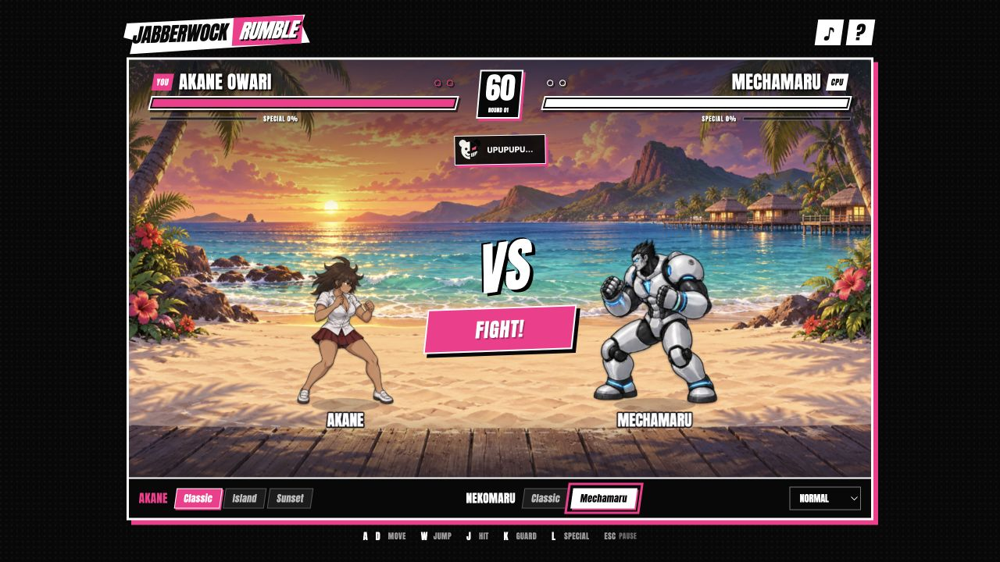

# Jabberwock Rumble

A simple arcade fighting game on Jabberwock Island: play as **Akane Owari** against **Nekomaru Nidai**, while Monokuma changes the rules mid-fight.

**Made to test the capabilities of GPT-6 Astra.** The game was generated starting from the single initial prompt quoted below. The published version also includes subsequent user-requested refinements to character accuracy, summer outfits, additional poses, and the simpler interface and typography.

**[Play in your browser](https://cubres.github.io/jabberwock-rumble/)** · **[Download the standalone HTML](https://github.com/cubres/jabberwock-rumble/raw/refs/heads/main/dist/Jabberwock%20Rumble.html)**



## Original prompt

> Can you make me a simple, mortal combat-like game between Nekomaru Nidai and Akane Owari from danganronpa? Generate sprites yourself, include a Mechamaru skin for Nekomaru and 2 more skins for Akane, make Nekomaru be an AI, while Akane be controlled by the player, make it be fun to play, the game itself, make it be on Jabberwock island and have Monokuma generate some obstacles or modifiers to the battle itself, I want the gameplay mechanics to be extremely simple but fun.

The exact text is also saved in [ORIGINAL_PROMPT.txt](ORIGINAL_PROMPT.txt). Generated-art prompts and provenance are recorded in [ARTWORK.json](ARTWORK.json).

## Play

Win two rounds. Close the distance, tap to combo, guard at the last moment, and spend a full meter on an ultimate attack.

| Action | Keyboard |
| --- | --- |
| Move | A / D or ← / → |
| Jump | W, ↑ or Space |
| Attack / combo | J |
| Hold guard | K |
| Ultimate | L |
| Pause | Esc or P |

Touch controls are included. Choose Easy, Normal, or Hard before starting.

- **Five cosmetic skins:** Akane's Classic, Island Athlete, and Sunset Sprinter; Nekomaru's Classic and Mechamaru.
- **60 generated poses:** 12 per skin, with punches, kicks, jumps, guards, damage reactions, and finish poses.
- **Monokuma events:** falling coconuts, low gravity, turbo speed, and healing rice balls.
- Synthesized sound effects, a reduced-flash-and-shake option, and no external runtime dependencies.

## Run locally

Open `index.html` in a modern browser, or serve this folder:

```sh
python3 -m http.server 8731 --bind 127.0.0.1
```

Then visit `http://127.0.0.1:8731/`. The file in `dist/` contains the complete game, including artwork and font, for offline play.

## Test and build

With Node.js installed; no package installation is needed:

```sh
npm test
npm run build
```

The tests cover combat, AI behavior, modifiers, round progression, and keyboard/touch input. The build regenerates `dist/Jabberwock Rumble.html` from the current source and assets.

## Credits

An unofficial Danganronpa fan game made as an AI capability experiment. Game code was produced with GPT-6 Astra; character sprites and island scenery were generated with the built-in image-generation tool. Danganronpa and its characters belong to their respective rights holders. This project is not affiliated with or endorsed by them.

The bundled Anton typeface is distributed under the [SIL Open Font License](assets/Anton-OFL.txt).
